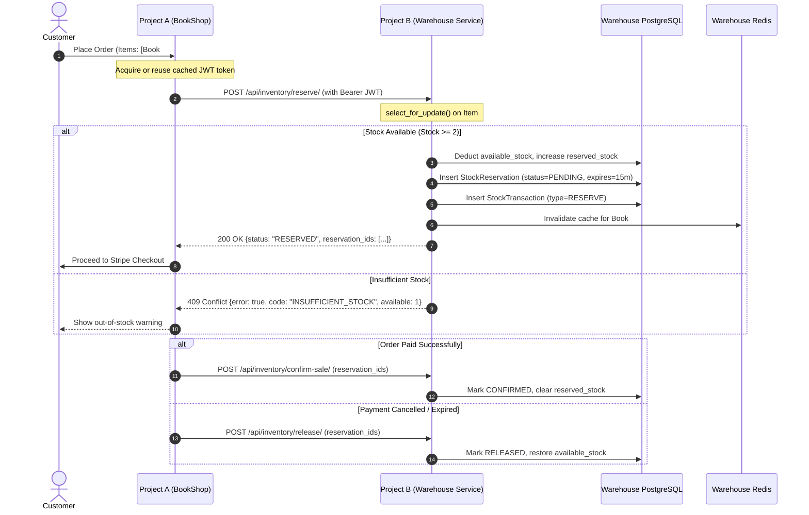

# Design Specification: Project B (Warehouse Management Microservice)

- **Date:** 2026-09-12
- **Topic:** Project B Warehouse Management & Inter-Service JWT Communication with Project A (BookShop)
- **Status:** Approved

---

## 1. Overview & Objectives

This specification defines the architecture, data models, inter-service communication, background workers, DevOps, and testing for **Project B (`BookShopWarehouse`)**—a dedicated microservice located in `d:\BookShopWarehouse` that operates in tandem with **Project A (`BookShop`)**.

### Key Requirements Addressed
* **Separate Django Projects:** Project A (BookShop) and Project B (Warehouse Management) communicate via REST API.
* **Core Technology Stack:** Django 5+, DRF, PostgreSQL, Redis, Celery, Docker Compose, NGINX, Gunicorn.
* **Mandatory Domain Elements:**
  * Custom User Model with role-based access control and groups.
  * Class-Based Views with inheritance.
  * JWT authentication for user and inter-service communication.
  * Celery background and periodic tasks.
  * Internationalization (i18n) supporting English (`en`) and Ukrainian (`uk`).
  * Caching using Redis.
* **Inter-Service Reliability:** Atomic stock reservations, error handling, structured logging, timeouts, and fallback.
* **Quality & Testing:** Automated test coverage $\ge 70\%$ (unit, integration, API tests).
* **DevOps & Monitoring:** Docker Compose multi-container setup, GitHub Actions CI/CD pipeline, Sentry monitoring, health checks.
* **Documentation:** OpenAPI/Swagger (`drf-spectacular`) and comprehensive `README.md` with architecture diagrams.

---

## 2. System Architecture & Inter-Service Flow

### 2.1 Communication Diagram



### 2.2 Directory Layout
Project B will reside in `d:\BookShopWarehouse`:
```text
BookShopWarehouse/
├── .github/workflows/
│   └── ci.yml
├── config/
│   ├── settings/
│   │   ├── __init__.py
│   │   ├── base.py
│   │   ├── development.py
│   │   └── production.py
│   ├── celery.py
│   ├── urls.py
│   └── wsgi.py
├── users/
│   ├── models.py
│   ├── permissions.py
│   ├── serializers.py
│   ├── views.py
│   ├── urls.py
│   └── tests.py
├── warehouse/
│   ├── models.py
│   ├── serializers.py
│   ├── views.py
│   ├── urls.py
│   ├── tasks.py
│   ├── services.py
│   └── tests/
│       ├── test_models.py
│       ├── test_api.py
│       ├── test_tasks.py
│       └── test_services.py
├── locale/
│   └── uk/LC_MESSAGES/
├── nginx/
│   └── nginx.conf
├── Dockerfile
├── docker-compose.yml
├── requirements.txt
├── pytest.ini
├── .env.example
└── README.md
```

---

## 3. Data Models & Access Control

### 3.1 Custom User Model (`users.models.CustomUser`)
* Extends `AbstractUser`.
* `role`: CharField with choices:
  * `ADMIN` (`admin`): Administrative superuser.
  * `WAREHOUSE_MANAGER` (`manager`): Inventory restock, audit views, reporting.
  * `WAREHOUSE_OPERATOR` (`operator`): Shelf location updates, stock inspection.
  * `SERVICE_ACCOUNT` (`service`): Non-interactive programmatic identity used by Project A.
* Helper properties: `is_manager`, `is_service_account`.
* Groups auto-provisioned: `Warehouse Managers`, `Warehouse Operators`, `Service Clients`.

### 3.2 Warehouse Domain Models (`warehouse.models`)
* **`Warehouse`**:
  * `name`: CharField(max_length=100)
  * `code`: CharField(max_length=20, unique=True)
  * `location_details`: CharField(max_length=255, blank=True)
  * `is_active`: BooleanField(default=True)
* **`WarehouseItem`**:
  * `warehouse`: ForeignKey(`Warehouse`, on_delete=CASCADE, related_name="items")
  * `book_id`: PositiveIntegerField(db_index=True) - maps to `Book.id` in Project A
  * `sku`: CharField(max_length=50, unique=True)
  * `title`: CharField(max_length=255)
  * `available_stock`: PositiveIntegerField(default=0)
  * `reserved_stock`: PositiveIntegerField(default=0)
  * `min_threshold`: PositiveIntegerField(default=5)
  * `shelf_location`: CharField(max_length=50, blank=True)
  * Property: `total_stock = available_stock + reserved_stock`
* **`StockReservation`**:
  * `id`: UUIDField(primary_key=True, default=uuid4, editable=False)
  * `item`: ForeignKey(`WarehouseItem`, on_delete=CASCADE, related_name="reservations")
  * `order_id`: PositiveIntegerField(db_index=True)
  * `quantity`: PositiveIntegerField()
  * `status`: CharField(choices=[`PENDING`, `CONFIRMED`, `RELEASED`, `EXPIRED`], default=`PENDING`)
  * `created_at`: DateTimeField(auto_now_add=True)
  * `expires_at`: DateTimeField()
* **`StockTransaction`**:
  * `item`: ForeignKey(`WarehouseItem`, on_delete=CASCADE, related_name="transactions")
  * `transaction_type`: CharField(choices=[`RESTOCK`, `RESERVE`, `CONFIRM_SALE`, `RELEASE`, `ADJUSTMENT`])
  * `quantity_change`: IntegerField()
  * `available_after`: PositiveIntegerField()
  * `reference_id`: CharField(max_length=100, blank=True)
  * `performed_by`: ForeignKey(`CustomUser`, null=True, blank=True, on_delete=SET_NULL)
  * `created_at`: DateTimeField(auto_now_add=True)
  * `notes`: TextField(blank=True)

---

## 4. API Endpoints & Class Inheritance

### 4.1 Base Classes
* `BaseAPIView(APIView)`: Injects latency timing, correlation IDs, exception interception, and structured logging.
* `BaseInventoryView(BaseAPIView)`: Encapsulates atomic database transaction management and lock handling.

### 4.2 Endpoints
* `POST /api/token/`: SimpleJWT token obtain pair.
* `POST /api/token/refresh/`: SimpleJWT refresh token.
* `POST /api/token/verify/`: SimpleJWT verify token.
* `GET /api/inventory/items/`: List/search items with filters (`book_id`, `sku`, `low_stock`).
* `GET /api/inventory/items/{book_id}/stock/`: Cached stock check (`available_stock`, `reserved_stock`).
* `POST /api/inventory/reserve/`: Atomic batch reservation for order checkout.
* `POST /api/inventory/confirm-sale/`: Commit reservations upon confirmed payment.
* `POST /api/inventory/release/`: Rollback reservations upon payment cancellation.
* `POST /api/inventory/restock/`: Manager endpoint to increment stock and log transactions.
* `GET /api/inventory/transactions/`: Audit trail history.
* `GET /health/` and `GET /api/health/`: Service liveness/readiness probes.
* `GET /api/schema/` & `GET /api/docs/`: OpenAPI 3.0 & Swagger UI via `drf-spectacular`.

---

## 5. Background Tasks & Caching

### 5.1 Celery Tasks (`warehouse.tasks`)
* `release_expired_reservations`: Scheduled via Celery Beat every 5 minutes. Selects pending reservations past `expires_at`, shifts stock back to `available_stock`, marks them `EXPIRED`, and logs audit transactions.
* `check_low_stock_alerts`: Scheduled daily/hourly. Identifies items at or below `min_threshold` and emits alert reports.
* `process_bulk_restock`: Async task for bulk CSV/JSON inventory updates.

### 5.2 Redis Caching
* Cached stock lookup on `GET /api/inventory/items/{book_id}/stock/` with 300s TTL.
* Cache eviction on reserve, confirm, release, or restock events.

---

## 6. Inter-Service Client in Project A (`BookShop`)

A dedicated client module `catalog/warehouse_client.py` in Project A:
* Requests and caches JWT access tokens in Redis.
* Handles timeouts (2s connect, 5s read) and transient retries.
* Exposes clean helper methods: `check_stock(book_id)`, `reserve_order_stock(order_id, items)`, `confirm_order_stock(order_id)`, `release_order_stock(order_id)`.
* Emits structured logs and Sentry alerts on communication anomalies.

---

## 7. Quality Assurance & DevOps

### 7.1 Testing ($\ge 70\%$ Coverage)
* Enforced `--cov-fail-under=70` in `pytest.ini`.
* Unit tests for custom user roles, permissions, model integrity.
* API tests covering authentication, atomic reservations, conflict handling, and releases.
* Celery task tests verifying expired reservation reclamation.

### 7.2 Containerization & CI/CD
* Multi-stage `Dockerfile` with non-root user.
* `docker-compose.yml` with `warehouse_db`, `warehouse_redis`, `warehouse_web`, `warehouse_celery`, `warehouse_celery_beat`, and `warehouse_nginx`.
* GitHub Actions workflow (`.github/workflows/ci.yml`) executing linting, unit/integration testing, coverage verification, and container build checks.
