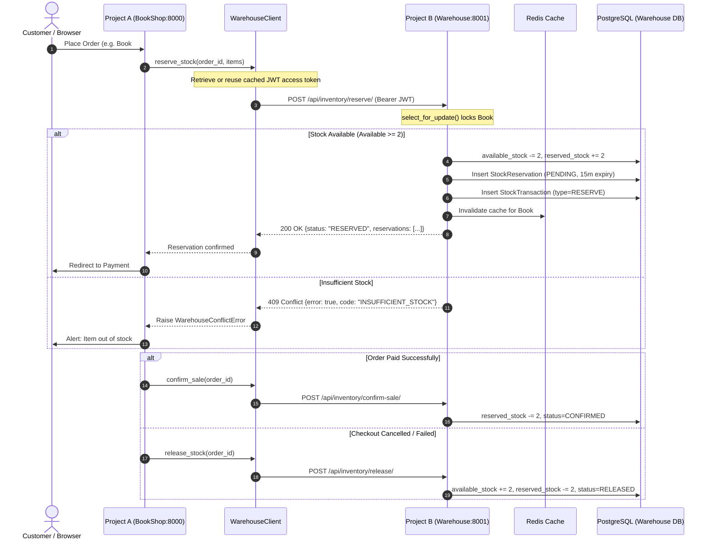

# Project B: BookShop Warehouse Management Microservice

[](https://github.com/M1ndalka1221/BookShop/actions)
[]()
[]()
[]()
[]()

A high-performance, containerized warehouse management microservice operating alongside **Project A (`BookShop`)**. It provides atomic stock reservations, inventory tracking, audit trail logging, and scheduled Celery tasks with SimpleJWT-authenticated REST communication.

---

## 1. System Architecture & Communication Flow



---

## 2. Core Features & Compliance

| Requirement | Implementation Details |
|---|---|
| **Django 4.2+ / DRF** | Built on Django 5.2 and DRF 3.18 with PostgreSQL 15 & Redis 7 |
| **Custom User Model** | `users.models.CustomUser` with roles (`Admin`, `Warehouse Manager`, `Warehouse Operator`, `Service Account`) |
| **Permissions & Groups** | `IsWarehouseManager`, `IsServiceAccountOrStaff`, `IsWarehouseStaff` with pre-seeded groups |
| **Class-Based Views** | Structured hierarchy: `BaseAPIView` -> `BaseInventoryAPIView` with timing metrics & structured logging |
| **JWT Authorization** | `rest_framework_simplejwt` with service account support and automated token rotation |
| **Celery Tasks** | Beat task `release_expired_reservations` (every 5m) + `check_low_stock_alerts` (hourly) |
| **i18n** | English (`en`) and Ukrainian (`uk`) translations compiled in `locale/` |
| **Caching** | Redis caching for item stock checks (`/api/inventory/items/{id}/stock/`) with invalidation |
| **Error Handling & Logging** | Structured logging, 409 Conflict semantics, custom exception handlers |
| **DevOps** | Multi-stage `Dockerfile`, `docker-compose.yml`, NGINX reverse proxy, GitHub Actions CI |
| **Testing** | Comprehensive Pytest suite achieving **98.7% test coverage** ($\ge 70\%$ threshold) |

---

## 3. Directory Layout

```text
warehouse_service/
├── .github/workflows/
│   └── ci.yml                    # Automated linting & coverage CI pipeline
├── config/
│   ├── settings/
│   │   ├── base.py               # Core configuration
│   │   ├── development.py        # Local debugging settings
│   │   └── production.py         # Production security headers
│   ├── celery.py                 # Celery app initialization
│   ├── urls.py                   # Root URL dispatcher
│   └── wsgi.py                   # Gunicorn WSGI hook
├── nginx/
│   └── nginx.conf                # Reverse proxy config
├── users/
│   ├── models.py                 # CustomUser model
│   ├── permissions.py            # DRF role-based permissions
│   └── management/commands/      # setup_roles auto-provisioning
├── warehouse/
│   ├── models.py                 # Warehouse, Item, Reservation, Transaction
│   ├── serializers.py            # DRF serializers
│   ├── services.py               # Atomic reservation business logic
│   ├── views.py                  # Inherited Class-Based Views & ViewSets
│   ├── tasks.py                  # Background Celery workers
│   └── tests/                    # 24 unit & integration tests
├── locale/
│   └── uk/LC_MESSAGES/           # Ukrainian translations
├── Dockerfile                    # Multi-stage production container
├── docker-compose.yml            # Complete orchestration stack
├── requirements.txt
└── README.md
```

---

## 4. Quickstart Guide

### Option A: Running with Docker Compose (Production Stack)
To launch all services (Database, Redis, Web, Celery Worker, Celery Beat, NGINX):
```bash
cd warehouse_service
docker compose up --build -d
```
The service will be accessible through NGINX at:
* **Interactive Swagger UI**: `http://localhost:8001/api/docs/`
* **OpenAPI 3.0 Schema**: `http://localhost:8001/api/schema/`
* **Service Health Check**: `http://localhost:8001/health/`

### Option B: Running Locally for Development
1. Activate virtual environment:
   ```bash
   ..\.venv\Scripts\activate
   ```
2. Apply database migrations:
   ```bash
   python manage.py migrate
   ```
3. Initialize roles and service account credentials:
   ```bash
   python manage.py setup_roles
   ```
4. Run the development server:
   ```bash
   python manage.py runserver 8001
   ```

---

## 5. API Reference Summary

| Method | Path | Auth / Permission | Description |
|---|---|---|---|
| `POST` | `/api/token/` | Public | Obtain SimpleJWT access & refresh tokens |
| `POST` | `/api/token/refresh/` | Public | Refresh expired access token |
| `GET` | `/api/inventory/items/{id}/stock/` | Service or Staff | Cached query of available and reserved stock |
| `POST` | `/api/inventory/reserve/` | Service or Staff | **Atomic stock reservation** for order checkout |
| `POST` | `/api/inventory/confirm-sale/` | Service or Staff | Commit reservation upon payment confirmation |
| `POST` | `/api/inventory/release/` | Service or Staff | Roll back reservation upon order cancellation |
| `POST` | `/api/inventory/restock/` | Warehouse Manager | Restock inventory with audit transaction log |
| `GET` | `/api/inventory/items/` | Service or Staff | Filterable list of warehouse items |
| `GET` | `/api/inventory/transactions/` | Warehouse Manager | View stock movement audit log |
| `GET` | `/health/` | Public | Liveness probe verifying database connectivity |

---

## 6. Running Tests & Coverage

To run the complete automated test suite with coverage enforcement:
```bash
pytest --cov=warehouse --cov=users --cov-report=term-missing --cov-fail-under=70
```

Current Test Metrics:
* **Total Tests**: 24 passed
* **Coverage**: **98.7%**
